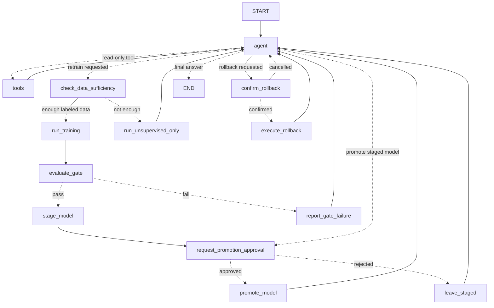

# iqPM

Agentic predictive-maintenance studio. A LangGraph agent (backed by Groq) reasons over live
per-machine sensor data, explains predictions with SHAP, and governs model retraining,
promotion, and rollback through an MLflow-backed model registry — all reachable identically
from chat or from dashboard buttons.

## Architecture

- `frontend/`: React + Vite workspace with IDE-style resizable chat and live-monitor panes.
- `backend/app/agent/`: the LangGraph agent — state schema, tools, graph, and the runtime that
  drives it from HTTP requests (chat, dashboard buttons, and a scheduled drift monitor all funnel
  into the same graph).
- `backend/app/services/`: data access (`readings.py`), the streaming simulator (`simulator.py`,
  `streamer.py`), model fitting (`training.py`), the MLflow registry wrapper (`registry.py`), the
  in-memory serving layer (`serving.py`), drift detection (`drift.py`), and read-only analytics
  (`analysis.py`, `deployment.py`).
- `postgres`: one table per machine (`readings_<machine_id>`) holding sensor features plus
  delayed ground-truth labels, and a table of LangGraph agent threads.
- `mlflow`: experiment tracking **and** the model registry. Every training run is logged with its
  metrics and model artifact; `Staging` → `Production` → `Archived` transitions happen only
  through the governed graph nodes, and the serving layer loads Production models straight out of
  the registry (`mlflow.sklearn.load_model`) — no local `.joblib` files.

## Agent design



- **`agent`** resolves the machine, decides between a read-only tool call, a governed subflow, or
  a direct reply, and turns the LLM's tool result into a natural-language explanation.
- **`evaluate_gate`** is deterministic Python, never LLM judgment: validation F1 must clear
  `MIN_F1_FOR_PROMOTION` **and** beat the current Production model re-scored on the same
  validation slice.
- **`request_promotion_approval`** and **`confirm_rollback`** use `langgraph.types.interrupt()` to
  pause the graph and surface a raw comparison payload; the frontend renders it and resumes the
  thread with an approve/reject decision.
- The drift monitor (`backend/app/agent/drift_monitor.py`) runs on a schedule, independent of any
  open conversation, and calls the **same** `check_data_sufficiency → … → request_promotion_approval`
  subgraph as a chat-triggered retrain — see `add_governed_retrain()` in `agent/graph.py`. A
  drift-triggered retrain is pushed into every open chat/monitor thread for that machine as a
  proactive message, complete with an inline approval card if one is pending.
- Dashboard buttons (`POST /machines/{id}/actions/{retrain|promote|rollback}`) construct the same
  tool call the LLM would and enter the graph through the same `agent` node — so a state change
  triggered by a click and one triggered by chat are the identical code path.

## Data flow

1. On startup the API seeds one Postgres table per machine (`readings_<machine_id>`) from
   `synthetic_timeseries.csv`, skipping machines that already have rows.
2. `POST /stream/start` runs a per-machine random walk (the same HEALTHY → DEGRADING →
   FAILED/REPAIR lifecycle as `generate_synthetic.py`, ported to `backend/app/services/simulator.py`)
   that appends one new, independent row per machine per tick, continuing from each machine's
   last stored row.
3. `machine_failure`, `state`, `label_horizon`, and `keep_for_training` are written immediately but
   only *queried* for training once `LABEL_REVEAL_LAG_HOURS` of simulated time have passed — the
   supervised pipeline can't see labels a real system wouldn't know yet.
4. Live prediction reads the latest row for a machine and scores it with whatever models are
   currently in the `Production` stage of the MLflow registry.
5. Supervised training builds a strict time-based 80/20 split over the rolling window, trains
   FLAML AutoML (LightGBM/XGBoost/RF) on `label_horizon`, and logs every FLAML trial as a nested
   MLflow run under the parent retrain run. Isolation Forest retrains independently, without a
   labeled-row minimum, and goes straight to Production (it has no supervised gate).

## Local run

```bash
cp .env.example .env   # add GROQ_API_KEY for natural-language replies (optional)
docker compose up --build
```

Open:

- Frontend: http://localhost:5173
- API docs: http://localhost:8000/docs
- MLflow: http://localhost:5000

Click **Start stream** in the top bar to begin streaming. The dashboard shows a status box
(**Healthy** / **Potential failure — monitor system closely** / **Anomaly detected — check
system**) per machine, a task-manager-style live chart with a tab per sensor, and Retrain /
Promote / Rollback buttons that drive the same governed graph as chat.

## Useful API calls

```bash
curl -X POST http://localhost:8000/stream/start
curl http://localhost:8000/machines
curl http://localhost:8000/machines/machine_01/current
curl -X POST http://localhost:8000/machines/machine_01/actions/retrain
curl http://localhost:8000/agent/threads/ops-machine_01
curl -X POST http://localhost:8000/agent/threads/ops-machine_01/resume -d '{"approved": true}'
curl http://localhost:8000/models/leaderboard
```

## Modeling notes

- Supervised target: `label_horizon` (does a failure begin within `LABEL_HORIZON_HOURS`?).
- Forbidden as model inputs: `machine_failure`, `state`, `keep_for_training`.
- Training window: latest `ROLLING_WINDOW_DAYS` simulated days per machine.
- Split: earliest 80% for training, most recent 20% for validation (strict time split; a run whose
  validation slice doesn't contain both classes fails cleanly with an explanatory message rather
  than silently training).
- Gate: F1 ≥ `MIN_F1_FOR_PROMOTION`, and better than the current Production model's F1 re-computed
  on the same validation slice.
- Isolation Forest retrains whenever a retrain runs, with no labeled-row minimum, and deploys
  straight to Production (unsupervised models have no promotion gate).
- SHAP `TreeExplainer` explains the Production supervised model directly (it's a LightGBM/XGBoost/
  RandomForest estimator retrieved from the MLflow-logged model, not a heuristic fallback).
- Drift is the mean population stability index (PSI) across sensors (tool wear excluded — it's a
  sawtooth counter that resets on every repair by design) between the Production model's training
  window and the last `DRIFT_WINDOW_HOURS`.

## Agent tools

Read-only (executed by the `tools` node): `get_prediction`, `explain_prediction`,
`profile_dataset`, `get_leaderboard`, `get_drift_status`, `plot_sensor_trend`,
`list_at_risk_machines`, `get_anomaly_score`, `get_sensor_stats`, `compare_models`,
`get_training_status`, `get_deployment_status`, `suggest_action`.

Governed (routed into a subflow, never executed directly): `retrain_model`, `promote_staged_model`,
`rollback_model`.
